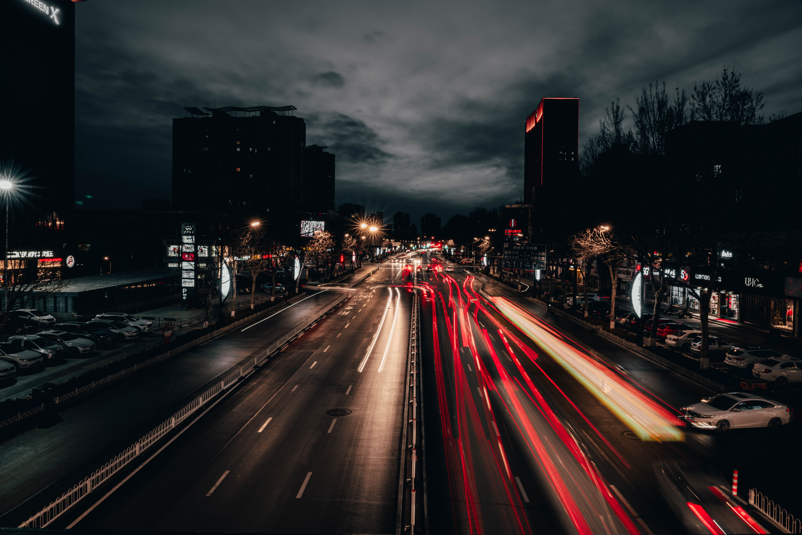
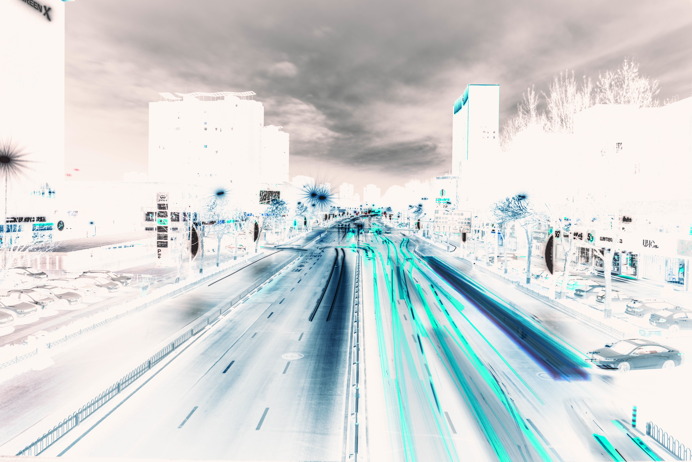
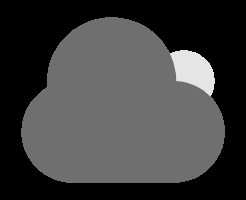
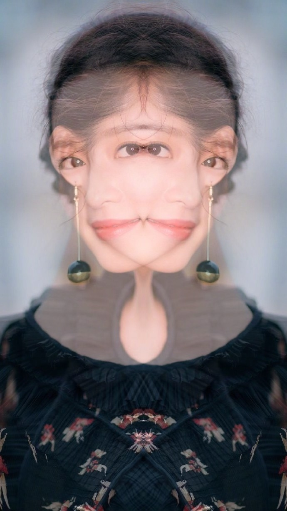
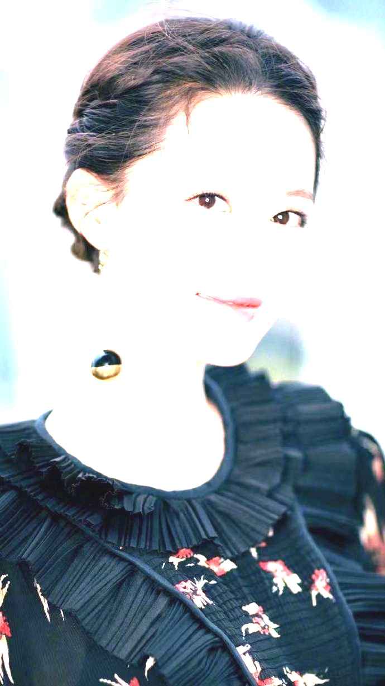
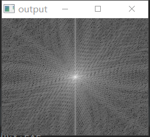
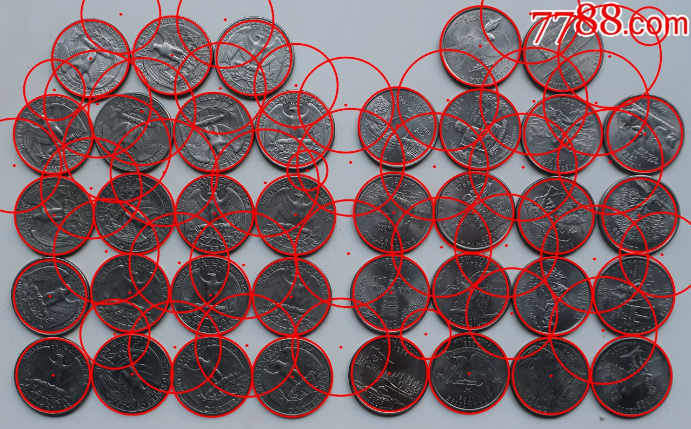

# OpenCV练习

## 1. 测试功能

把这部分的内容放在[test1.cpp](mCode/test1.cpp)

### 1.1 基础

#### 1.1.0 基础复制和LUT操作

主要是进行一些验证

**代码**：

```c++
void function1_0(){
    // Mat复制操作
    Mat A;
    A = imread("D:/Downloads/Browser/cloud.png", IMREAD_COLOR);
    Mat B(A);
    Mat D(A, Rect(30, 30, 100, 100));
    Mat E = A(Range::all(), Range(1, 20));
    Mat F;
    F.create(200, 200, CV_8UC(2));
    Mat M(200, 200, CV_8UC3, Scalar(0, 0, 225));
    int sz[3] = {2, 2, 2};
    Mat L(3, sz, CV_8UC(1), Scalar::all(0));

//    imshow("A", A);
//    imshow("B", B);
//    imshow("D", D);
//    imshow("E", E);
//    imshow("F", F);
//    imshow("M", M);

    // LUT
    uchar lutData[256];
    for (int i = 0; i < 256; ++i){
        // 反相LUT
        lutData[i] = 255 - i;
    }
    Mat lutTable(1,256, CV_8U);
    uchar *p = lutTable.ptr();
    for (int i = 0; i < 256; ++i){
        p[i] = lutData[i];
    }
    Mat G;
    LUT(A, lutTable, G);
//    imshow("G, after lut", G);

    Mat myPhoto = imread("D:/DCIMed/picked/DSC00510-1.jpg");
    Mat myPhotoEd;
    LUT(myPhoto, lutTable, myPhotoEd);
    namedWindow("raw", WINDOW_NORMAL);
    namedWindow("edited", WINDOW_NORMAL);
    imshow("raw", myPhoto);
    imshow("edited", myPhotoEd);
    imwrite("D:/Personal Files/project files/PI-LAB/learn_slam/images/raw1.jpg", myPhoto);
    imwrite("D:/Personal Files/project files/PI-LAB/learn_slam/images/edited1.jpg", myPhotoEd);
    waitKey(0);
}
```

**结果**：





#### 1.1.1 加载与灰度

利用openCV库加载图像，并且将图像转化为灰度图，进行存储

**注意**：

* ctvColor函数，openCV之前的版本是CV_RGB2GRAY，但是4.2.0版本是COLOR_RGB2GRAY；
* 要注意有的地方是BGR有的是RGB，官方文档里好像是排序问题
* 注意waitKey()函数，参数值分大于小于等于0三种情况

**代码**：

```c++
void function1_1(){
    // 加载图片并转换为灰度图
    cout << "Work1-1" << endl;
    string srcPath = "D:/Downloads/Browser/cloud.png";
    string dstPath = "D:/Personal Files/project files/PI-LAB/learn_slam/images/cloud_gray.png";
//    Mat src = imread(R"(D:\Downloads\Browser\cloud.png)");
    // 上面这种写法是ClangTidy建议的，Raw地址的写法，实际写到双引号里面是\\的形式
    // 个人感觉地址单独列出的形式，封装性更好，也更清楚
    Mat src = imread(srcPath);
    Mat dst;
    if (src.empty()){
        cout << "error! image load failed" << endl;
    }else{
        cout << "loading image..." << endl;
    }
    cvtColor(src, dst, COLOR_BGR2GRAY); // 注意这里是OpenCV4.2.0的参数，之前的是CV_RGB2GRAY
    imshow("input", src);
    imshow("output", dst);
    imwrite(srcPath, src);
    imwrite(dstPath, dst);
    waitKey(0);
}
```

**结果**：




#### 1.1.2 矩阵的掩膜操作

作用：提高对比度，掩膜矩阵可以自己定义；如果用kernel+filter2D方法，则自己定义Mat矩阵；如果用公式法循环，则体现在公式中

**注意**：

* 矩阵的行、列中，有一个元素需要考虑通道数，即该图像为单通道时，矩阵行列即为`mat.col`,`mat.row`得到的；但有多通道时则为`col=image.channel()*mat.col`
* 利用指针获取图像元素

**代码**：

```c++
void function1_2(){
    // 矩阵的掩膜操作
    cout << "Mat mask/kernel" << endl;
    Mat src, dst;
    string srcPath = "D:/Personal Files/project files/PI-LAB/learn_slam/images/learn_slam.jpg";
    src = imread(srcPath);
    if (src.empty()){
        // 也可以用!src.data()
        cout << "couldn't load the image" << endl;
        exit(100);
    }
    //获取图像的长度和宽度，但需要考虑channel
    int cols = src.cols * src.channels();
    int rows = src.rows;
    int srcChannels = src.channels();
    dst.create(src.size(), src.type()); //输出图像初始化

    // Mat kernel operation
    for (int row = 1; row < rows - 1; row++){
        const uchar* previous = src.ptr(row - 1);
        const uchar* current = src.ptr(row);
        const uchar* next = src.ptr(row + 1);
        uchar* output = dst.ptr(row);
        for (int col = srcChannels; col < cols - srcChannels; col++){
            output[col] = saturate_cast<uchar>(5 * current[col] - (current[col - srcChannels] + current[col + srcChannels] +
                    previous[col] + next[col]));
        }
    }

    namedWindow("output", WINDOW_AUTOSIZE);
    imshow("output", dst);
    namedWindow("src", WINDOW_AUTOSIZE);
    imshow("src", src);

    waitKey(0);

    /**
     * openCV中给出了掩膜函数，filter2D
     * Mat kernel = (Mat_<char>(3, 3) << 0, -1, 0,
     *                                  -1, -5, -1,
     *                                   0, -1, 0);
     * filter2D(src, dst, src.depth(), kernel)
     */
}
```


**疑问**：

* 看起来像是增加了对比度（亮的更亮，暗的更暗），但是锐度好像也增加了
* 对像素BGR数值进行加减运算就可以提升对比度？
* 在官方文档中将这一操作称为sharpen（锐化）


#### 1.1.3 图片的线性融合

(linear cross-dissolve)

**思路**：

* 需要保证两张图片类型和像素大小完全一样，于是我找了张图做了个翻转，发现像素变了，于是拿翻转了的再翻转一遍

**代码**：

```c++
void function1_3(){
    //混合两张图片，线性融合，交叉溶解
    cout << "add/blend two images" << endl;

    double alpha = 0.5; double beta; double gamma = 0;

    Mat src1, src2, dst;

    src1 = imread("D:/Personal Files/project files/PI-LAB/learn_slam/images/test1-3ed1.jpeg");
    src2 = imread("D:/Personal Files/project files/PI-LAB/learn_slam/images/test1-3ed.jpeg");
    cout << "src1 channels:" << src1.channels() << ", " << "src1 size:" << src1.rows << "*" << src1.cols << endl;
    cout << "src2 channels:" << src2.channels() << ", " << "src2 size:" << src2.rows << "*" << src2.cols << endl;
    if (src1.empty()){
        cout << "can't load that image..." << endl;
        exit(100);
    }

    beta = 1 - alpha;
    addWeighted(src1, alpha, src2, beta, gamma, dst);

    imshow("Linear blend", dst);
    waitKey(0);
    imwrite("\"D:/Personal Files/project files/PI-LAB/learn_slam/images/test1-3final.jpeg", dst);
}
```




#### 1.1.4 图片的亮度和对比度处理

**思路**：

* 需要着重注意`saturate_cast<uchar>`函数

**代码**：

```c++
void function1_4(){
    //对比度和亮度操作
    cout << "Changing contrast and brightness" << endl;
    Mat image = imread("D:/Personal Files/project files/PI-LAB/learn_slam/images/test1-3ed1.jpeg");

    Mat new_image = Mat::zeros( image.size(), image.type() );

    double alpha = 1.0; /* Simple contrast control */
    int beta = 0;       /* Simple brightness control */

    cout << " Basic Linear Transforms " << endl;
    cout << "-------------------------" << endl;
    cout << "* Enter the alpha value [1.0-3.0]: "; cin >> alpha;
    cout << "* Enter the beta value [0-100]: ";    cin >> beta;

    for (int i = 0; i < image.rows; i++){
        for (int j = 0; j < image.cols; j++){
            for (int c = 0; c < image.channels(); c++){
                new_image.at<Vec3b>(i, j)[c] =
                        saturate_cast<uchar>( alpha*image.at<Vec3b>(i, j)[c] + beta );
            }
        }
    }

    imshow("Original Image", image);
    imshow("New Image", new_image);
    waitKey(0);
    imwrite("D:/Personal Files/project files/PI-LAB/learn_slam/images/test1-4.jpeg", new_image);

}
```

对比度选择1.2倍，亮度加20之后的结果如下



**疑问**：

* 一般提高对比度是指，亮的地方更亮，暗的地方更暗，但是当$\alpha>1$且$\beta>0$时，所有像素值均提高了，只是差值变大，这也算一种提高对比度
* 另外，如果用`saturate_cast<uchar>`函数仍可能出现图像过曝或欠曝现象，这时就需要引入$\gamma$修正，[Gamma correction - Wikipedia](https://en.wikipedia.org/wiki/Gamma_correction)

#### 1.1.5 离散傅里叶变换

* 需要注意这个代码是对灰度图

**代码**

```c++
void function1_5(){
    // 离散傅里叶变换
    cout << "DFT: Discrete Fourier Transform" << endl;

    // read image
    Mat I = imread("../../images/cloud.png", IMREAD_GRAYSCALE);
    if (I.empty()){
        cout << "Error! Image load failed..." << endl;
        exit(100);
    }

    // expand the image to optimal size
    Mat padded;
    int m = getOptimalDFTSize( I.rows );
    int n = getOptimalDFTSize( I.cols );
    copyMakeBorder(I, padded, 0, m - I.rows, 0, n - I.cols, BORDER_CONSTANT, Scalar::all(0));

    // make place for real and complex values
    Mat planes[] = {Mat_<float>(padded), Mat::zeros(padded.size(), CV_32F)};
    Mat complexI;
    merge(planes, 2, complexI);

    // make discrete transform
    dft(complexI, complexI);

    // trans IM and RE values to magnitude
    split(complexI, planes);
    magnitude(planes[0], planes[1], planes[0]);
    Mat magI = planes[0];

    // transfer to log scale
    magI += Scalar::all(1);
    log(magI, magI);

    // crop and rearrange
    magI = magI(Rect(0, 0, magI.cols & -2, magI.rows & -2));
    int cx = magI.cols/2;
    int cy = magI.rows/2;
    Mat q0(magI, Rect(0, 0, cx, cy));   // Top-Left - Create a ROI per quadrant
    Mat q1(magI, Rect(cx, 0, cx, cy));  // Top-Right
    Mat q2(magI, Rect(0, cy, cx, cy));  // Bottom-Left
    Mat q3(magI, Rect(cx, cy, cx, cy)); // Bottom-Right
    Mat tmp;
    q0.copyTo(tmp);
    q3.copyTo(q0);
    tmp.copyTo(q3);
    q1.copyTo(tmp);
    q2.copyTo(q1);
    tmp.copyTo(q2);

    // normalize
    normalize(magI, magI, 0, 1, NORM_MINMAX);

    // reload
    namedWindow("input", WINDOW_AUTOSIZE);
    namedWindow("output", WINDOW_AUTOSIZE);
    imshow("input", I);
    imshow("output", magI);
    waitKey(0);
    imwrite("D:/Personal Files/project files/PI-LAB/learn_slam/images/test1-5.png", magI);
}
```




**物理意义**：

* 图像的频率是表征图像中灰度变化剧烈程度的指标，是灰度在平面空间上的梯度
* 傅里叶变换的物理意义是将图像的灰度分布函数变换为图像的频率分布函数
* 如果频谱图中亮的点数多，那么实际图像一定是尖锐的、边界分明且边界两边像素差异较大的
* 一幅频谱图如果带有正弦干扰，移频到原点上就可以看出，除了中心以外还存在以另一点为中心、对称分布的亮点集合，这个集合就是干扰噪音产生的
* 参考[傅里叶变换在图像处理中的应用](https://www.cnblogs.com/tenderwx/p/5245859.html)

#### 1.1.6 霍夫圆检测

使用霍夫圆检测算法，`HoughCircle()`；

主要注意调参；

```cpp
void cv::HoughCircles	(	InputArray 	image,
							OutputArray 	circles,
							int 	method,
							double 	dp,
							double 	minDist,
							double 	param1 = 100,
							double 	param2 = 100,
							int 	minRadius = 0,
							int 	maxRadius = 0 
)		
```

我使用的参数如下：

```c++
    // Hough circle detecting
    vector<Vec3f> circlePoints;
    HoughCircles(gray_img, circlePoints,
                 HOUGH_GRADIENT, 1, 80,
                 100, 30, 30, 100); // detecting points of 8-gray
                 // https://docs.opencv.org/4.5.2/dd/d1a/group__imgproc__feature.html#ga47849c3be0d0406ad3ca45db65a25d2d
    img.copyTo(final_img);
    for (auto l : circlePoints){
        circle(final_img,
               Point(l[0], l[1]), l[2],
               Scalar(0, 0, 255), 2, LINE_AA);
        circle(final_img,
               Point(l[0], l[1]), 1,
               Scalar(0, 0, 255), 2, LINE_AA);
    } // suggest using int rather than float?
    // FIXME: 这参数也太难调了，如果在一个工程中，图片可能是动态的（用户输入的），该如何调参？？
    // minRadius/maxRadius 设置成default 0 ，运算会爆炸
```

参数比较难调，出图效果不理想：



可以看出，出现了很多不应该出现的圆，调的参数主要有间距，最小半径，最大半径


## 2. 项目实战

### 2.1 RGB图像传达信息

**思考**：给定一张RGB图像，可以是风景，人像或是Mat随机生成的RGB图像，如何把想表达的信息（比如一段英文）加到该图像中，使得该图像单从肉眼看察觉不到异常，但是经过程序处理，就可以得到图像中的信息；

大致可以分为发-收， 编码-译码**两个环节**；

* 编码过程，在RGB图像中对像素进行操作，附上信息
* 译码过程，在RGB图像中检测改动的像素，得到信息

现有的**两种思路**：

* 原图和修改后的图片都需要，这样可以直接按像素RGB比对，找到不同的像素，按算法解析出信息
* 特定算法，在附上信息时对像素的选择按照算法，比如有一个可以判断该处像素改变后会不会引起肉眼察觉的算法，通过该算法筛选可以加信息的点，解码时则需要判断出这些点（算法比较困难感觉）

**主要困难**：

* 肉眼分辨的量不容易定义
* 第二种思路的算法

