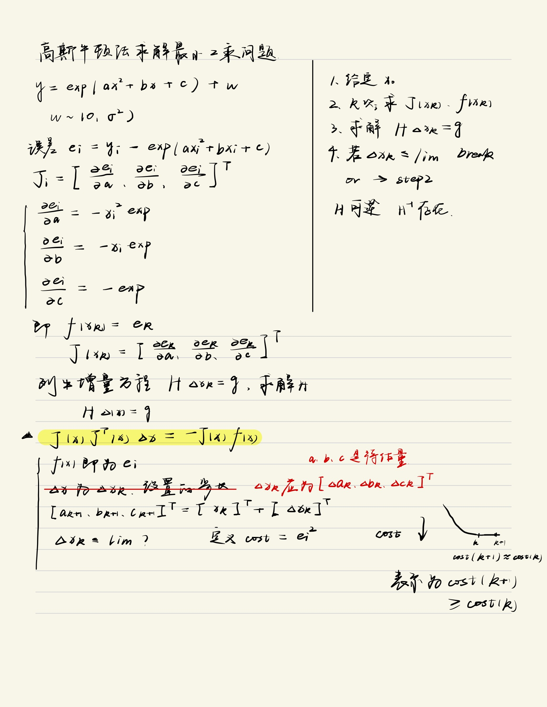
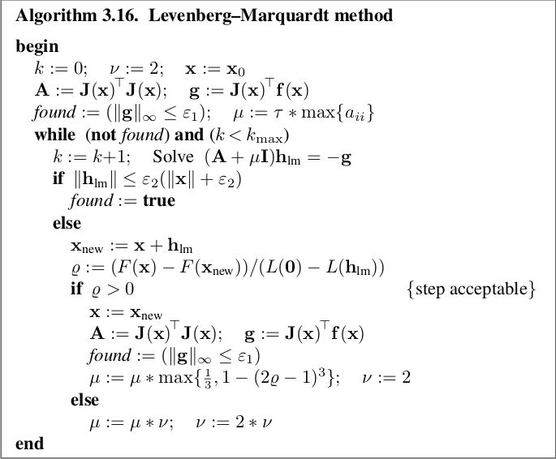

# Non-Linear Optimization
## 0. Contents
* [Gauss Newton Method](gaussNewton.cpp)
* [Levenberg-Marquardt Method](LMMethod.cpp)
* [Ceres Curve Fitting](ceresCurveFitting.cpp)
## 1. Main Body
### 1.1 Gauss Newton Method

### 1.2 LM Method

### 1.3 Ceres
* Functor, used like a function

### 1.4 G2O
* https://www.cnblogs.com/gaoxiang12/p/5304272.html

## 2. Reference
* SLAM BOOK2, https://github.com/gaoxiang12/slambook2
* Methods for Non-Linear the Least Square Problem by DTU, http://www2.imm.dtu.dk/pubdb/edoc/imm3215.pdf
* A bolg in `CSDN` about LM method, not precise enough, https://blog.csdn.net/qq_16481211/article/details/85055854

## 3. Issues
* [blog](https://blog.csdn.net/qq_16481211/article/details/85055854) conflicts with SLAM BOOK2 in LM method on 
Definition of `GainRatio`
* what is Functor in C++, http://www.noobyard.com/article/p-qcslzrcb-gm.html
* `_x(x)` meaning in [Ceres Curve Fitting](ceresCurveFitting.cpp), https://www.coder.work/article/589160
* http://www.noobyard.com/article/p-uxckkpex-na.html
* http://www.noobyard.com/article/p-hcwaairx-y.html